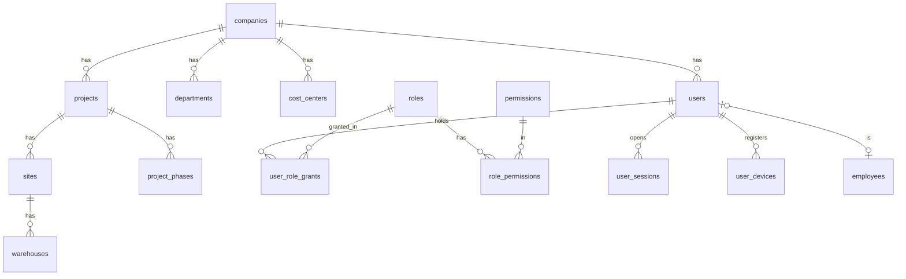
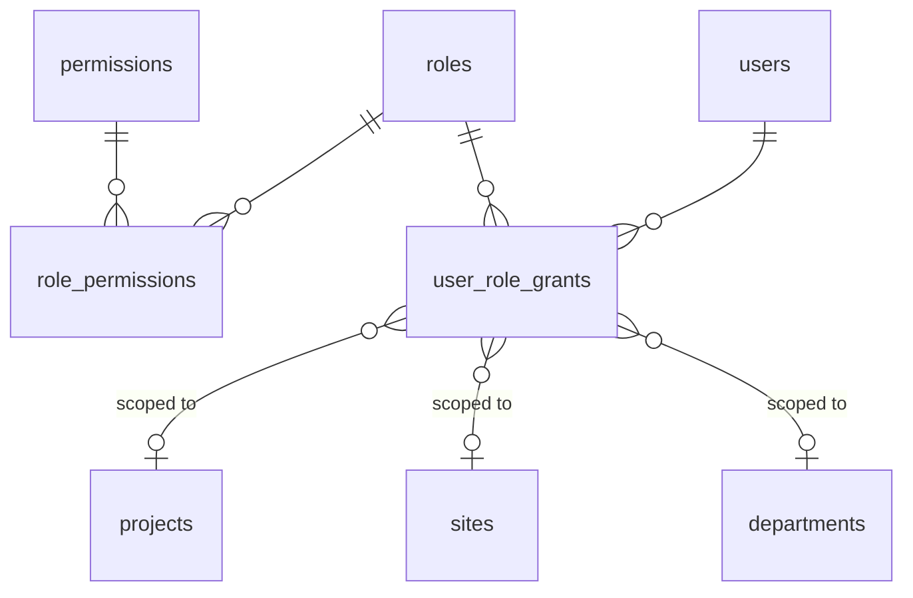
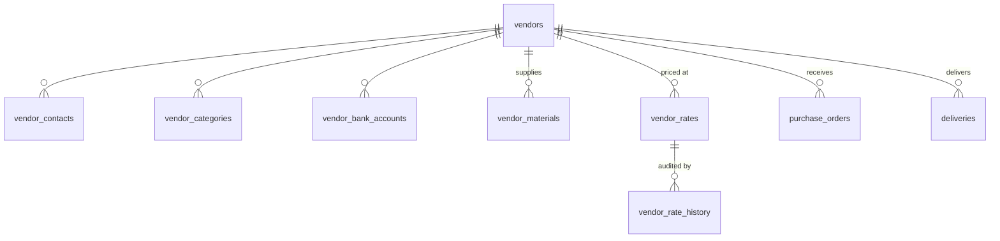
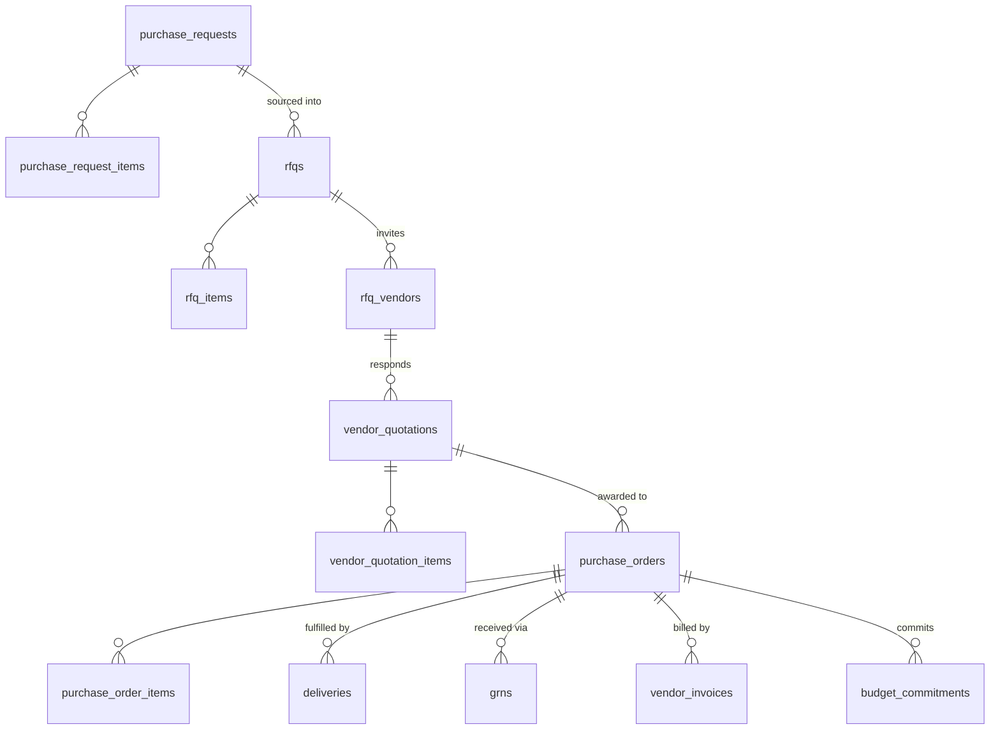
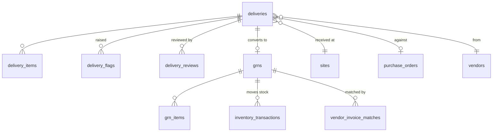
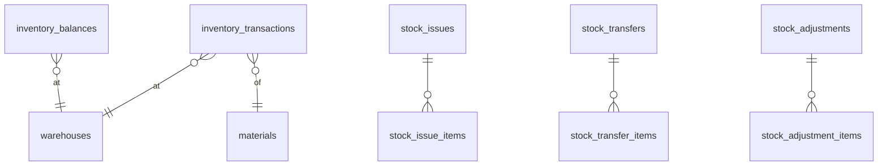
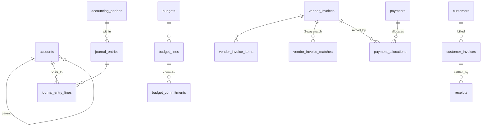
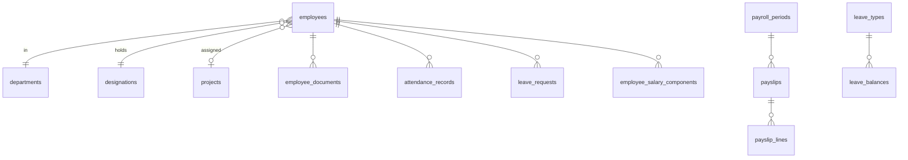

# 02 — Data Model & ERD

PostgreSQL 16 + PostGIS. ~78 tables in v1. Mermaid diagrams below render in GitHub and in the
VS Code Markdown preview (Markdown Preview Mermaid extension).

---

## 0. Conventions

Every business table carries this base:

| Column | Type | Notes |
|---|---|---|
| `id` | `uuid` PK | UUIDv7, generated application-side, time-ordered |
| `company_id` | `uuid` NOT NULL FK | On every business table without exception. Indexed first in composite indexes |
| `created_at` / `updated_at` | `timestamptz` NOT NULL | `now()` default; `updated_at` maintained by trigger |
| `created_by` / `updated_by` | `uuid` FK users | Nullable only for system-generated rows |
| `version` | `integer` NOT NULL DEFAULT 1 | Optimistic locking on concurrently edited aggregates |

Master data additionally gets `deleted_at timestamptz NULL` and `is_active boolean`. **Transactional
tables never get `deleted_at`** (§17, §31) — they are cancelled, reversed or voided.

Other rules:
- Money: `numeric(18,4)`. Quantity: `numeric(18,4)`. Rate: `numeric(18,6)`. Percentage:
  `numeric(9,6)`. **No floats anywhere in finance, inventory or delivery.**
- Currency: `currency_code char(3)` on every monetary document, plus `fx_rate numeric(18,8)` and
  `base_amount` on financial documents. v1 operates single-currency but the columns exist so
  multi-currency is a configuration change, not a migration of every amount column.
- Enumerations are `text` columns with `CHECK` constraints, not PostgreSQL `ENUM` types — adding a
  value to a PG enum inside a transaction is painful, and CHECK constraints are trivially altered.
- Status transitions are enforced in the domain layer **and** guarded by partial unique indexes /
  CHECKs where a bad state would be corrupting.
- Every FK is declared, `ON DELETE RESTRICT` by default. `CASCADE` only for owned child rows
  (e.g. `purchase_order_items`).
- `citext` for emails and codes that must be case-insensitively unique.

---

## 1. Organisation & identity



| Table | Key columns | Notes |
|---|---|---|
| `companies` | `code` uniq, `name`, `legal_name`, `tax_id`, `base_currency`, `fiscal_year_start_month`, `timezone`, `settings jsonb` | Root of the hierarchy. One row in v1. |
| `projects` | `code` uniq per company, `name`, `project_type`, `status`, `start_date`, `end_date`, `manager_user_id`, `location`, `total_budget` | `status` in DRAFT/ACTIVE/ON_HOLD/CLOSED/CANCELLED. |
| `project_phases` | `project_id`, `code`, `name`, `sequence`, `planned_start/end`, `status` | Seeded with Land Development, Roads, Sewerage, Water, Electricity, Landscaping, Buildings, Earthworks. |
| `sites` | `project_id`, `code`, `name`, `address`, `centroid geography(Point,4326)`, `boundary geography(Polygon,4326) NULL`, `geofence_radius_m numeric(10,2)`, `timezone`, `is_active` | Geofence is **radius from centroid OR polygon**; polygon wins when present. GIST index on both geometry columns. |
| `departments` | `company_id`, `code`, `name`, `parent_department_id`, `head_employee_id` | Self-referencing tree. |
| `cost_centers` | `company_id`, `code`, `name`, `project_id NULL`, `department_id NULL`, `is_active` | A charge bucket; may or may not be project-bound. |
| `users` | `email citext` uniq, `phone citext` uniq, `password_hash`, `full_name`, `status`, `must_change_password`, `failed_login_count`, `locked_until`, `last_login_at`, `default_project_id`, `default_site_id`, `employee_id NULL` | Mobile logs in with **phone**, web with **email** — both resolve to the same row (§13). |
| `user_sessions` | `user_id`, `refresh_token_hash`, `device_id`, `ip`, `user_agent`, `issued_at`, `expires_at`, `revoked_at`, `rotated_from_id` | Refresh-token rotation chain; reuse of a rotated token revokes the whole chain. |
| `user_devices` | `user_id`, `device_uid`, `platform`, `app_version`, `push_token`, `last_seen_at`, `is_trusted` | Mobile device registry; also the sync cursor owner. |
| `password_reset_tokens` | `user_id`, `token_hash`, `expires_at`, `used_at` | |

---

## 2. Access control



| Table | Key columns |
|---|---|
| `permissions` | `code` uniq (`procurement.approve`), `module`, `action`, `description`, `is_system` |
| `roles` | `company_id`, `code`, `name`, `description`, `is_system`, `is_assignable` |
| `role_permissions` | `role_id`, `permission_id`, PK(both) |
| `user_role_grants` | `user_id`, `role_id`, `scope_type` (GLOBAL/COMPANY/PROJECT/SITE/DEPARTMENT), `scope_id NULL`, `valid_from`, `valid_to NULL`, `granted_by` — unique on (user, role, scope_type, scope_id) |

Detailed semantics in [03-rbac](03-rbac.md).

---

## 3. Master data, units and conversions

```mermaid
erDiagram
    material_categories ||--o{ material_categories : parent
    material_categories ||--o{ materials : classifies
    units ||--o{ materials : "base unit"
    units ||--o{ unit_conversions : from
    units ||--o{ unit_conversions : to
    materials ||--o{ material_units : "alternate units"
    materials ||--o{ unit_conversions : "scoped override"
    warehouses ||--o{ inventory_balances : holds
```

| Table | Key columns | Notes |
|---|---|---|
| `material_categories` | `code`, `name`, `parent_id`, `path ltree` | Aggregates / Sand / Cement / Steel / Concrete / Pipes / Electrical. |
| `materials` | `sku` uniq per company, `name`, `category_id`, `description`, `base_unit_id`, `tracking_type` (QUANTITY/BATCH/SERIAL), `min_stock`, `max_stock`, `reorder_level`, `standard_rate`, `hsn_code`, `is_active`, `attributes jsonb` | `tracking_type` present from day one so batch tracking for cement/steel is additive. |
| `material_units` | `material_id`, `unit_id`, `is_purchase_default`, `is_issue_default` | Alternate units permitted for a material (§9). |
| `units` | `code` uniq, `name`, `dimension` (MASS/VOLUME/LENGTH/COUNT/AREA), `precision` | |
| `unit_conversions` | `from_unit_id`, `to_unit_id`, `factor numeric(24,12)`, `scope_type` (GLOBAL/MATERIAL/VENDOR/MATERIAL_VENDOR), `material_id NULL`, `vendor_id NULL`, `effective_from date`, `effective_to date NULL`, `created_by` | **The unit-conversion engine** (§20). Resolution is most-specific-first: MATERIAL_VENDOR → MATERIAL → GLOBAL, filtered by date. Nothing is hard-coded; `1 tonne = X cft` is a row an administrator maintains. Append-only: a changed factor closes the old row and inserts a new one. |
| `truck_types` | `code`, `name`, `default_max_tonnage`, `axle_count` | Referenced by tonnage rules. |
| `warehouses` | `site_id`, `code`, `name`, `type` (SITE_STORE/CENTRAL/TRANSIT), `is_active` | Stock is held at warehouse granularity, never at "site" directly. |

**Conversion snapshotting:** any document that applies a conversion stores `conversion_factor` and
`conversion_id` on the line. Later factor edits never restate historical documents.

---

## 4. Vendors and rates



| Table | Key columns | Notes |
|---|---|---|
| `vendors` | `code` uniq, `legal_name`, `trade_name`, `vendor_type`, `tax_id`, `tax_registration_no`, `payment_terms_days`, `status` (DRAFT/PENDING_APPROVAL/ACTIVE/SUSPENDED/BLACKLISTED), `address jsonb`, `is_active` | |
| `vendor_contacts` | `vendor_id`, `name`, `designation`, `phone`, `email`, `is_primary` | |
| `vendor_bank_accounts` | `vendor_id`, `account_title`, `account_no`, `iban`, `bank_name`, `branch`, `is_primary`, `verified_at`, `verified_by` | Changing a bank account is a high-risk event: always audited, optionally approval-gated. |
| `vendor_materials` | `vendor_id`, `material_id`, `lead_time_days`, `min_order_qty` | |
| `vendor_rates` | `vendor_id`, `material_id`, `unit_id`, `rate numeric(18,6)`, `currency_code`, `project_id NULL`, `site_id NULL`, `effective_from date`, `effective_to date NULL`, `status`, `approved_by`, `source` (MANUAL/PO/QUOTATION), `notes` | **Append-only, effective-dated** (§19). Exclusion constraint prevents overlapping periods for the same (vendor, material, unit, project, site). Superseding a rate sets `effective_to = new.effective_from - 1 day`. |
| `vendor_rate_history` | `vendor_rate_id`, `old_rate`, `new_rate`, `changed_by`, `changed_at`, `reason`, `superseded_rate_id` | The human-facing "Rs 48 → Rs 52, 12 Aug" trail. |
| `vendor_performance_facts` | `vendor_id`, `period_month`, `deliveries_count`, `on_time_count`, `rejected_count`, `qty_variance_pct`, `quality_incidents` | Materialised nightly. **Facts only, no composite score** (§11, D-13). |

**Rate resolution** (used by the sync ingest, exactly as the prototype's docstring specified):
given `(vendor, material, unit, site, captured_at)`, pick the most specific non-expired rate —
site → project → company — with `effective_from <= captured_at::date` and
`(effective_to IS NULL OR effective_to >= captured_at::date)`. The chosen `vendor_rate_id` **and**
the literal `rate` value are snapshotted onto the delivery.

---

## 5. Procurement



| Table | Key columns | Notes |
|---|---|---|
| `purchase_requests` | `pr_number` uniq, `project_id`, `site_id`, `department_id`, `cost_center_id`, `phase_id`, `required_date`, `justification`, `estimated_amount`, `status`, `requested_by`, `submitted_at`, `approval_request_id` | Status: DRAFT/SUBMITTED/UNDER_APPROVAL/APPROVED/REJECTED/PARTIALLY_SOURCED/SOURCED/CANCELLED. |
| `purchase_request_items` | `pr_id`, `line_no`, `material_id`, `quantity`, `unit_id`, `estimated_rate`, `estimated_amount`, `required_date`, `sourced_quantity`, `notes` | `sourced_quantity` closes the loop back from POs. |
| `rfqs` | `rfq_number` uniq, `project_id`, `site_id`, `issue_date`, `due_date`, `status`, `terms`, `created_by` | |
| `rfq_items` | `rfq_id`, `line_no`, `material_id`, `quantity`, `unit_id`, `pr_item_id NULL` | |
| `rfq_vendors` | `rfq_id`, `vendor_id`, `invited_at`, `responded_at`, `status` (INVITED/VIEWED/QUOTED/DECLINED/NO_RESPONSE), `access_token_hash` | The token supports a future vendor portal without a schema change. |
| `vendor_quotations` | `quotation_number`, `rfq_id`, `vendor_id`, `quote_date`, `valid_until`, `delivery_days`, `payment_terms`, `subtotal`, `tax_amount`, `total_amount`, `currency_code`, `status` (RECEIVED/SHORTLISTED/SELECTED/REJECTED), `selection_reason`, `selected_by`, `selected_at` | **No automatic vendor selection** (§10). `selection_reason` is NOT NULL when status = SELECTED. |
| `vendor_quotation_items` | `quotation_id`, `rfq_item_id`, `material_id`, `quantity`, `unit_id`, `rate`, `discount_pct`, `tax_pct`, `line_total`, `delivery_days`, `remarks` | Drives the side-by-side comparison grid. |
| `purchase_orders` | `po_number` uniq, `vendor_id`, `project_id`, `site_id`, `phase_id`, `cost_center_id`, `quotation_id NULL`, `po_date`, `expected_delivery_date`, `delivery_address`, `payment_terms`, `terms_and_conditions`, `subtotal`, `discount_amount`, `tax_amount`, `total_amount`, `currency_code`, `fx_rate`, `status`, `approval_request_id`, `closed_at`, `close_reason` | Status: DRAFT/PENDING_APPROVAL/APPROVED/SENT/ACKNOWLEDGED/PARTIALLY_RECEIVED/RECEIVED/CLOSED/CANCELLED. Approved PO writes a `budget_commitments` row. |
| `purchase_order_items` | `po_id`, `line_no`, `material_id`, `description`, `quantity`, `unit_id`, `rate`, `discount_pct`, `tax_code`, `tax_pct`, `tax_amount`, `line_total`, `received_quantity`, `accepted_quantity`, `invoiced_quantity`, `pr_item_id NULL` | The three running totals are what make 3-way matching possible without recomputing history. |
| `po_amendments` | `po_id`, `revision_no`, `changed_fields jsonb`, `reason`, `approved_by`, `created_at` | POs are amended, never edited silently. |

---

## 6. Deliveries, flags and GRN — the core of Site Ledger



### `deliveries`
Generalises the prototype's `TruckEntry`. One truck movement = one delivery.

| Column | Notes |
|---|---|
| `id uuid PK` | **Client-generated on mobile.** Doubles as the sync idempotency key. |
| `delivery_number` | Assigned server-side on first successful ingest. |
| `company_id, project_id, site_id` | Site is authoritative for geofence evaluation. |
| `vendor_id`, `purchase_order_id NULL`, `po_item_id NULL` | Nullable PO pending business decision Q3 (see doc 11). |
| `truck_number`, `truck_type_id`, `driver_name`, `driver_phone` | |
| `challan_number`, `challan_date` | The vendor's own delivery note reference. |
| `status` | DRAFT / SUBMITTED / UNDER_REVIEW / APPROVED / REJECTED / RECEIVED / PARTIALLY_RECEIVED / CANCELLED (§17). |
| `captured_lat/lng numeric(10,7)`, `captured_point geography(Point,4326)`, `gps_accuracy_m`, `location_source` (GPS/NETWORK/MANUAL) | |
| `distance_from_site_m numeric(12,2)` | Computed at ingest via `ST_Distance` against the site geofence. |
| `is_inside_geofence boolean` | |
| `captured_at timestamptz` | Device clock, on site. |
| `received_at timestamptz` | Server clock at ingest. |
| `clock_skew_seconds integer` | `received_at - captured_at`, minus measured offset. Large skew is itself a flag. |
| `device_id`, `app_version`, `sync_batch_id`, `was_offline boolean` | Provenance. |
| `submitted_by`, `submitted_at`, `reviewed_by`, `reviewed_at`, `approved_by`, `approved_at`, `rejected_by`, `rejected_at`, `rejection_reason` | §17 requires every one of these. |
| `flag_count integer`, `has_open_flags boolean` | Denormalised for the review queue index. |
| `grn_id NULL` | Set when converted. |

Indexes: `(company_id, site_id, captured_at DESC)`, `(company_id, status) WHERE has_open_flags`,
`(vendor_id, captured_at)`, GIST on `captured_point`, unique on `(company_id, delivery_number)`.

### `delivery_items`
Usually one row (one truck, one material), but the table is multi-line so mixed loads and
future consolidated deliveries do not need a schema change.

`delivery_id, line_no, material_id, quantity numeric(18,4), unit_id, converted_quantity,
converted_unit_id, conversion_factor, conversion_id, rate numeric(18,6), vendor_rate_id,
rate_source, amount numeric(18,4), remarks`

The rate and the conversion factor are **snapshotted values**, resolved server-side at ingest
(never sent by the device), so a later rate or factor change cannot restate a past delivery (§19, §20).

### `delivery_flags`
| Column | Notes |
|---|---|
| `delivery_id`, `flag_type` | TONNAGE_ANOMALY / GEOFENCE_MISMATCH / CLOCK_SKEW / DUPLICATE_SUSPECT / NO_PO / PO_QTY_EXCEEDED / RATE_MISSING / VENDOR_INACTIVE / LATE_SUBMISSION |
| `severity` | INFO / WARNING / CRITICAL |
| `rule_id`, `rule_snapshot jsonb` | Which configured rule fired, and its values at the time |
| `expected_value`, `actual_value`, `deviation` | e.g. expected 16.0000, actual 22.0000, +37.5% |
| `message` | "Tonnage 22.0t exceeds 16.0t maximum for 10-wheeler / Crush" |
| `status` | OPEN / ACCEPTED / REJECTED / CORRECTED / WAIVED |
| `resolved_by`, `resolved_at`, `resolution_note` | |

### `delivery_reviews`
`delivery_id, action (ACCEPT/REJECT/REQUEST_CORRECTION/REOPEN), reviewer_id, reviewed_at,
comments, corrected_fields jsonb, previous_status, new_status`. Append-only. Requesting a
correction pushes the delivery back to the device's queue with the reviewer's note attached.

### `grns` / `grn_items`
| `grns` | Notes |
|---|---|
| `grn_number` uniq, `delivery_id NULL`, `purchase_order_id`, `vendor_id`, `site_id`, `warehouse_id`, `received_date`, `status` (DRAFT/PENDING_APPROVAL/APPROVED/POSTED/CANCELLED), `inspection_result` (PENDING/PASSED/FAILED/PARTIAL), `inspected_by`, `gross_amount`, `tax_amount`, `net_amount`, `posted_at`, `journal_entry_id NULL` | A GRN may exist without a delivery (counter purchase) and a delivery may exist without a GRN (rejected). |
| `grn_items` | `grn_id, line_no, po_item_id NULL, delivery_item_id NULL, material_id, ordered_quantity, delivered_quantity, accepted_quantity, rejected_quantity, rejection_reason, unit_id, rate, vendor_rate_id, amount, batch_no, expiry_date` |

`CHECK (accepted_quantity + rejected_quantity = delivered_quantity)`. Posting a GRN is the moment
inventory and the GL move — never before.

---

## 7. Inventory



| Table | Notes |
|---|---|
| `inventory_transactions` | **The append-only stock ledger.** `warehouse_id, material_id, txn_type (GRN_IN/ISSUE_OUT/TRANSFER_OUT/TRANSFER_IN/ADJUST_IN/ADJUST_OUT/RETURN_IN/RETURN_OUT), quantity_in, quantity_out, unit_id, unit_cost, value_in, value_out, balance_quantity_after, balance_value_after, source_type, source_id, source_line_id, project_id, site_id, cost_center_id, transaction_date, posted_at, reversal_of_id NULL`. Never updated, never deleted. Corrections are contra rows. |
| `inventory_balances` | `(warehouse_id, material_id)` unique. `quantity_on_hand, quantity_reserved, quantity_in_transit, average_cost, total_value, last_transaction_id, last_movement_at`. A **cached projection**, updated in the same transaction as the ledger row under a `SELECT ... FOR UPDATE` on the balance row. A nightly job recomputes from the ledger and alerts on divergence. |
| `stock_issues` / `_items` | Material issued to a project phase / contractor / cost centre. `issue_number, warehouse_id, project_id, phase_id, issued_to_type (EMPLOYEE/CONTRACTOR/WORK_ORDER), issued_to_id, status, approval_request_id`. |
| `stock_transfers` / `_items` | Site A → Site B. Two ledger rows per line (OUT then IN), with `in_transit` state between dispatch and receipt. |
| `stock_adjustments` / `_items` | `reason_code` NOT NULL, `approval_request_id` NOT NULL — an adjustment without an approved reason is not permitted (§22). |

Valuation: **weighted average cost** in v1, computed on the ledger. The columns support FIFO later
(a `stock_layers` table) without touching existing rows.

---

## 8. Finance



| Table | Key columns / notes |
|---|---|
| `accounts` | Chart of accounts. `code` uniq, `name`, `account_type` (ASSET/LIABILITY/EQUITY/REVENUE/EXPENSE/COGS_DEV_COST), `parent_id`, `path ltree`, `is_postable`, `normal_balance` (DR/CR), `requires_project`, `requires_cost_center`, `is_active`. Only leaf accounts are postable. |
| `accounting_periods` | `fiscal_year`, `period_no`, `start_date`, `end_date`, `status` (OPEN/CLOSED/LOCKED), `closed_by`, `closed_at`. Posting into a non-OPEN period is rejected in the service layer and by a trigger. |
| `journal_entries` | `je_number` uniq, `entry_date`, `period_id`, `source_type` (MANUAL/GRN/INVOICE/PAYMENT/PAYROLL/INVENTORY/DEPRECIATION), `source_id`, `description`, `reference`, `status` (DRAFT/PENDING_APPROVAL/POSTED/REVERSED), `posted_at`, `posted_by`, `reversal_of_id`, `approval_request_id`, `total_debit`, `total_credit` |
| `journal_entry_lines` | `je_id`, `line_no`, `account_id`, `debit numeric(18,4)`, `credit numeric(18,4)`, `description`, and the **dimension set**: `project_id, phase_id, site_id, department_id, cost_center_id, vendor_id, customer_id, employee_id, material_id`. `CHECK ((debit > 0 AND credit = 0) OR (credit > 0 AND debit = 0))`. Balance is enforced by a deferred constraint trigger: `SUM(debit) = SUM(credit)` per entry at commit. |
| `posting_rules` | `source_type`, `event`, `condition jsonb`, `debit_account_id`, `credit_account_id`, `priority`. Sub-ledger → GL mapping is configuration, not code, so an accountant can change which account a GRN accrual hits. |
| `budgets` | `project_id`, `fiscal_year`, `name`, `version`, `status` (DRAFT/APPROVED/REVISED/CLOSED), `approved_by`, `total_amount` |
| `budget_lines` | `budget_id`, `phase_id`, `cost_center_id`, `account_id`, `material_category_id NULL`, `period_id NULL`, `budgeted_amount`, `revised_amount`, `committed_amount`, `actual_amount`, `remaining_amount` (generated), `variance_pct` (generated). The Roads 100M / Sewerage 60M / Water 40M / Electricity 80M structure from §6 is exactly `budget_lines` keyed by phase. |
| `budget_commitments` | Append-only. `budget_line_id, source_type (PO/CONTRACT), source_id, amount, released_amount, status (OPEN/PARTIALLY_RELEASED/RELEASED/CANCELLED)`. An approved PO commits; a posted GRN releases the commitment and books the actual. This is what makes *budget → commitment → actual → remaining* true rather than decorative. |
| `vendor_invoices` | `invoice_number` + `vendor_id` uniq, `vendor_invoice_ref`, `invoice_date`, `due_date`, `purchase_order_id NULL`, `subtotal`, `tax_amount`, `withholding_amount`, `total_amount`, `paid_amount`, `outstanding_amount` (generated), `status` (DRAFT/PENDING_MATCH/MATCHED/DISPUTED/APPROVED/PARTIALLY_PAID/PAID/CANCELLED), `journal_entry_id`, `approval_request_id` |
| `vendor_invoice_items` | `invoice_id, line_no, po_item_id NULL, grn_item_id NULL, material_id, quantity, unit_id, rate, tax_pct, amount, account_id` |
| `vendor_invoice_matches` | `invoice_item_id, po_item_id, grn_item_id, qty_variance, rate_variance, amount_variance, within_tolerance boolean, tolerance_rule_id`. **This table is the 3-way match** (§6: PO → GRN → Invoice → Payment). Out-of-tolerance variance blocks approval and routes to a dispute. |
| `payment_requests` | `request_number`, `vendor_id`, `amount`, `requested_by`, `priority`, `status`, `approval_request_id` |
| `payments` | `payment_number`, `payment_date`, `vendor_id NULL`, `customer_id NULL`, `direction` (OUT/IN), `method` (BANK_TRANSFER/CHEQUE/CASH/ONLINE), `bank_account_id`, `instrument_no`, `gross_amount`, `withholding_amount`, `net_amount`, `status`, `journal_entry_id`, `cleared_at` |
| `payment_allocations` | `payment_id, invoice_id, allocated_amount`. A payment may settle several invoices and an invoice may be settled by several payments — allocation is explicit, never inferred. |
| `customers`, `customer_invoices`, `customer_invoice_items`, `receipts`, `receipt_allocations` | AR mirror of the AP structure. Minimal in v1 pending decision Q4 (plot sales / instalments). |
| `bank_accounts` | Company's own accounts. `account_title, account_no, iban, bank_name, currency_code, gl_account_id, opening_balance` |
| `tax_codes` | `code, name, rate_pct, tax_type (SALES/WITHHOLDING/INPUT), gl_account_id, effective_from, effective_to`. Effective-dated, so a rate change never restates old documents. |

---

## 9. Human resources



| Table | Notes |
|---|---|
| `employees` | `employee_code` uniq, `user_id NULL`, `first_name`, `last_name`, `national_id` (CNIC/Aadhaar/other — the label is a company setting), `dob`, `gender`, `phone`, `email`, `address jsonb`, `department_id`, `designation_id`, `project_id`, `site_id`, `manager_employee_id`, `joining_date`, `confirmation_date`, `employment_type` (PERMANENT/CONTRACT/DAILY_WAGE/CONSULTANT), `status` (ACTIVE/ON_LEAVE/SUSPENDED/RESIGNED/TERMINATED), `exit_date`, `exit_reason` |
| `designations` | `code, name, grade, department_id NULL` |
| `employee_documents` | Via the shared `attachments` table with `entity_type='employee'`, plus `document_type`, `expires_at` for CNIC/licence expiry alerts. |
| `attendance_records` | `employee_id, attendance_date, site_id, check_in_at, check_out_at, check_in_lat/lng, check_out_lat/lng, source (WEB/MOBILE/BIOMETRIC/MANUAL), status (PRESENT/ABSENT/LATE/HALF_DAY/LEAVE/HOLIDAY/WEEKEND), late_minutes, overtime_minutes, worked_minutes, remarks, approved_by`. Unique on `(employee_id, attendance_date)`. The lat/lng columns exist now so GPS attendance (§7) is a client change only. |
| `shifts`, `employee_shifts`, `holidays` | Calendars that make "late" and "overtime" computable rather than guessed. |
| `leave_types` | `code, name, annual_quota, is_paid, carry_forward_allowed, max_carry_forward, requires_document_after_days` |
| `leave_balances` | `employee_id, leave_type_id, fiscal_year, entitled, carried_forward, taken, pending, available` (generated) |
| `leave_requests` | `employee_id, leave_type_id, from_date, to_date, days, half_day_flag, reason, status, approval_request_id, approved_by, rejection_reason` |
| `salary_components` | `code, name, component_type (EARNING/DEDUCTION/EMPLOYER_CONTRIB), calculation_type (FIXED/PERCENT_OF/FORMULA), basis_component_id, is_taxable, gl_account_id` — the plug-in point for country tax packs (§7). |
| `employee_salary_components` | `employee_id, component_id, amount, percentage, effective_from, effective_to`. Effective-dated: a raise never rewrites last month's payslip. |
| `payroll_periods` | `period_code, from_date, to_date, status (DRAFT/PROCESSING/APPROVED/PAID/CLOSED), processed_by, journal_entry_id` |
| `payslips` / `payslip_lines` | Snapshot of every component value at processing time — payslips are immutable once approved. |

---

## 10. Workflow, rules, and platform tables

| Table | Notes |
|---|---|
| `approval_workflows` | `doc_type, name, version, scope_type, scope_id, is_active, effective_from`. See [04-approval-engine](04-approval-engine.md). |
| `approval_rules` | `workflow_id, sequence, condition jsonb, stop_on_match` |
| `approval_steps` | `rule_id, step_no, approver_type (ROLE/USER/DYNAMIC/GROUP), approver_ref, quorum_type (ANY/ALL/N_OF_M), quorum_count, sla_hours, escalate_to_type/ref, allow_delegate, allow_self_approve` |
| `approval_requests` | Runtime. `doc_type, doc_id, workflow_id, workflow_snapshot jsonb, current_step_no, status, initiated_by, completed_at, outcome` |
| `approval_request_steps` | `request_id, step_no, status, due_at, escalated_at, decided_at` |
| `approval_actions` | Append-only. `request_step_id, actor_id, action (APPROVE/REJECT/DELEGATE/COMMENT/RECALL), comments, acted_at, acted_ip` |
| `business_rules` | The configurable-rule store (§44). `rule_type, scope jsonb, condition jsonb, value jsonb, priority, effective_from, effective_to, is_active`. See [05-rules-and-rates](05-rules-and-rates.md). |
| `attachments` | `entity_type, entity_id, file_name, content_type, size_bytes, storage_key, checksum_sha256, uploaded_by, uploaded_at, is_public, virus_scan_status`. One polymorphic table; `(entity_type, entity_id)` indexed. Storage key is opaque so R2/S3/B2/MinIO are interchangeable (§28). |
| `notifications` | `user_id, type, title, body, entity_type, entity_id, channel, priority, read_at, sent_at, delivery_status` |
| `notification_preferences` | `user_id, notification_type, channel, is_enabled` |
| `audit_logs` | `company_id, actor_user_id, actor_role, action, entity_type, entity_id, old_values jsonb, new_values jsonb, changed_fields text[], summary, ip inet, user_agent, device_id, request_id, occurred_at`. Insert-only; no UPDATE or DELETE grant for the application role. Monthly partitions from year 2. |
| `outbox_events` | `event_type, aggregate_type, aggregate_id, payload jsonb, occurred_at, processed_at, attempts, last_error, status` |
| `idempotency_keys` | See §4.3 of doc 01. |
| `sync_cursors` | `device_id, entity_type, last_server_seq, last_synced_at` |
| `sync_batches` | `device_id, user_id, received_at, op_count, applied_count, rejected_count, duplicate_count, app_version, network_type` |
| `document_sequences` | `company_id, doc_type, fiscal_year, prefix, next_value, padding`. Row-locked allocation gives gapless numbers. |
| `report_definitions` / `saved_views` | User-saved filters and column sets for the ERP grids (§36). |

---

## 11. Indexing strategy

Indexes are declared from real query patterns, not speculatively:

| Query | Index |
|---|---|
| Review queue: open flags by company | `deliveries (company_id, captured_at DESC) WHERE has_open_flags` (partial) |
| Site day-book | `deliveries (company_id, site_id, captured_at DESC)` |
| Vendor ledger | `deliveries (vendor_id, captured_at DESC)`, `vendor_invoices (vendor_id, status, due_date)` |
| Geofence evaluation | `GIST (sites.boundary)`, `GIST (sites.centroid)`, `GIST (deliveries.captured_point)` |
| Rate resolution | `vendor_rates (company_id, vendor_id, material_id, unit_id, effective_from DESC)` + exclusion constraint on the period |
| Stock ledger by material | `inventory_transactions (company_id, warehouse_id, material_id, transaction_date, id)` |
| Trial balance | `journal_entry_lines (account_id, je_id)` + `journal_entries (company_id, period_id, status)` |
| Project cost report | `journal_entry_lines (project_id, account_id) INCLUDE (debit, credit)` |
| Audit lookup | `audit_logs (entity_type, entity_id, occurred_at DESC)`, `audit_logs (actor_user_id, occurred_at DESC)` |
| Approval inbox | `approval_request_steps (status, due_at) WHERE status = 'PENDING'` |
| Sync pull | every syncable table gets `updated_at` + a `server_seq bigint` from a shared sequence, indexed |

---

## 12. Data-integrity invariants enforced in the database

These are the constraints that make the auditability promises in §45 structurally true rather than
a matter of application discipline:

1. `journal_entries`: deferred trigger — total debits = total credits, and both > 0, at commit.
2. `journal_entry_lines`: exactly one of debit/credit is positive.
3. `journal_entries`: no posting into a period whose status is not OPEN.
4. `vendor_rates`: `EXCLUDE USING gist` — no overlapping effective periods per
   (company, vendor, material, unit, project, site).
5. `grn_items`: `accepted + rejected = delivered`, all >= 0.
6. `purchase_order_items`: `received_quantity <= quantity * (1 + tolerance)` enforced in service
   with the tolerance rule; `invoiced_quantity <= received_quantity` enforced by CHECK.
7. `inventory_transactions`: exactly one of `quantity_in` / `quantity_out` is positive; no UPDATE
   or DELETE grant to the application role.
8. `payment_allocations`: `SUM(allocated) <= payment.net_amount` and
   `<= invoice.total_amount - invoice.paid_amount`, enforced by trigger.
9. `audit_logs`, `inventory_transactions`, `approval_actions`, `vendor_rate_history`,
   `delivery_reviews`: `REVOKE UPDATE, DELETE` from the application database role. Append-only is
   enforced by the grant, not by hope.
10. `deliveries`: a row may not move from a terminal status (APPROVED/REJECTED/CANCELLED) except
    through an explicit reopen action that writes a `delivery_reviews` row.
